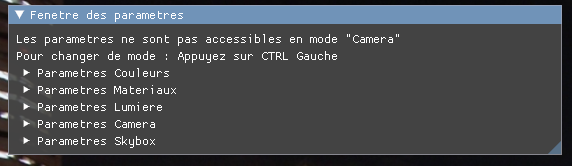
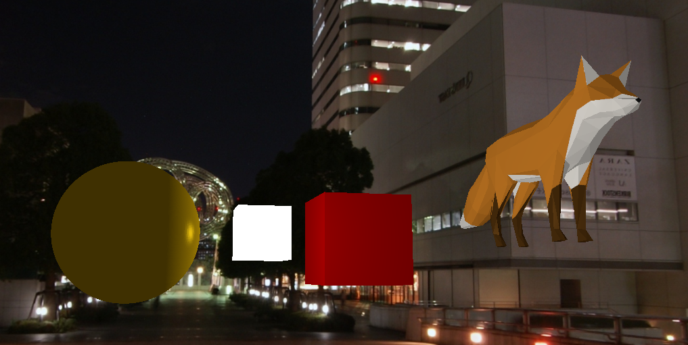

# 4I_IG1 - Projet OpenGL

Projet portant sur la réalisation, l'affichage et la navigation dans une scène 3D comportant plusieurs objets 3D.

# Développeurs

- Colin LE PICHON - colin.lepichon@edu.esiee.fr
- Mathieu PELLAN - mathieu.pellan@edu.esiee.fr
- Baptiste PERRIN - baptiste.perrin@edu.esiee.fr
- Mathieu TAILLANDIER - mathieu.taillandier@edu.esiee.fr

# Fonctionnement

Lors de la navigation dans la scène de test, vous pouvez déplacer la caméra à partir des touches : **Z, Q, S, D** et la faire pivoter à partir de **la souris**.

Vous retrouverez aussi une interface de paramétrage de la scène OpenGL. 
Pour pouvoir interagir avec cette dernière, il faut l'activer à partir de la touche **CTRL Gauche**.

## Interface de paramétrage

À partir d'une interface réajustable implémentée grâce à la librairie IMGUI, il est possible de changer divers paramètres :

- les couleurs - les objets changent de couleur après qu'un code RGBA leur a été donné
- la lumière - les différentes lumières de couleur émises
- la caméra - sa vitesse de déplacement et sa sensibilité à la souris
- skybox - les différentes images de fond

# Réalisations

Lors de ce projet, nous avons réalisé divers développements basés sur un cahier des charges donné.

